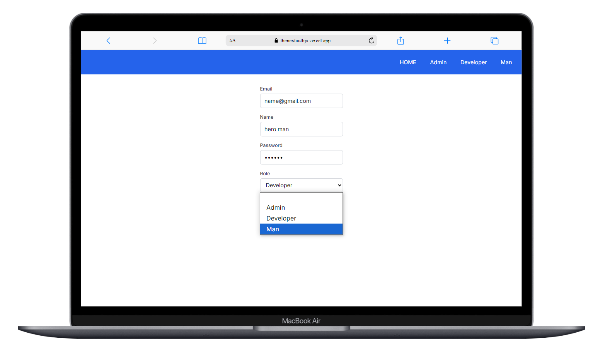
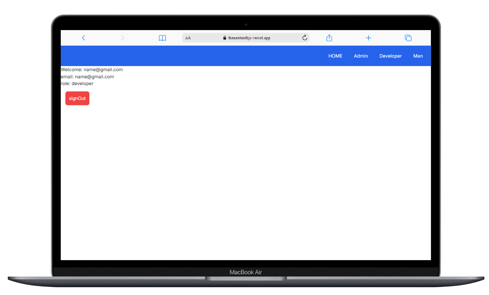
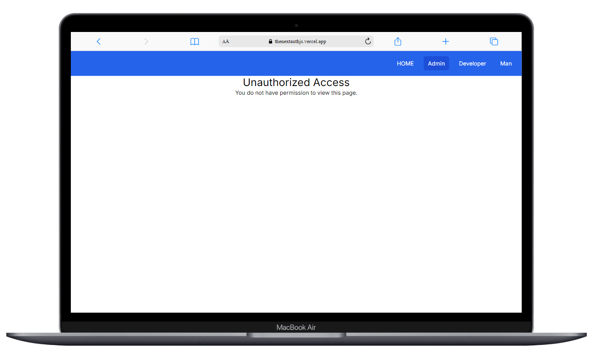

#  next-authentication-authorization

## Example showing a custom login page using NextAuth.js with credentials. It is used in more than one role With built in authentication authorization

### Feel free to use it as you like 💖.


## Getting Started


 

# [Demo🌋](https://thenextauthjs.vercel.app/)  


A simple application on Nextjs authentication authorization using next-auth.js
It consists of 3 different roles, each role has its own page
Of course, the header should appear according to the type of role, but the goal is to know how to use next-auth.js
You can be a contributor to the project

This is a [Next.js](https://nextjs.org/) project bootstrapped with [`create-next-app`](https://github.com/vercel/next.js/tree/canary/packages/create-next-app).
---

First, run the development server:


```bash
npm run dev
# or
yarn dev
# or
pnpm dev
# or
bun dev
```
second add .env
```
NEXTAUTH_SECRET=98E3B2CC28F61492C6934531C828C
NEXTAUTH_URL=http://localhost:3000/

```
 
> **⚠️ Very Important Alert**  
>Make sure that your project is running on http://localhost:3000 and nothing else. If your project is running on another port or url , you must put it in a .env 

>Problems will appear when changing the port and URL without changing them in the .env file.
 




Open [http://localhost:3000](http://localhost:3000) with your browser to see the result.

You can start editing the page by modifying `app/page.js`. The page auto-updates as you edit the file.

This project uses [`next/font`](https://nextjs.org/docs/basic-features/font-optimization) to automatically optimize and load Inter, a custom Google Font.

## Learn More

To learn more about Next.js, take a look at the following resources:

- [Next.js Documentation](https://nextjs.org/docs) - learn about Next.js features and API.
- [Learn Next.js](https://nextjs.org/learn) - an interactive Next.js tutorial.

You can check out [the Next.js GitHub repository](https://github.com/vercel/next.js/) - your feedback and contributions are welcome!


### 📚 References
- 🔗 [NextAuth.js Official Site](https://next-auth.js.org/)
- 🔗 [Next.js Official Site](https://nextjs.org/)
- 🔗 [NextAuth.js - Advanced Middleware Configuration](https://next-auth.js.org/configuration/nextjs#advanced-usage)
- 🔗 [NextAuth.js - Persisting the Role](https://authjs.dev/guides/basics/role-based-access-control#persisting-the-role)
- 🔗 [NextAuth.js - TypeScript Module Augmentation](https://next-auth.js.org/getting-started/typescript#module-augmentation
)
- 🔗 [NextAuth.js - JWT & Session Callbacks](https://next-auth.js.org/configuration/callbacks#jwt-callback)
- 🔗 [Next.js Rewrites](https://nextjs.org/docs/app/api-reference/functions/next-response#rewrite)

## Deploy on Vercel

The easiest way to deploy your Next.js app is to use the [Vercel Platform](https://vercel.com/new?utm_medium=default-template&filter=next.js&utm_source=create-next-app&utm_campaign=create-next-app-readme) from the creators of Next.js.

Check out our [Next.js deployment documentation](https://nextjs.org/docs/deployment) for more details.
